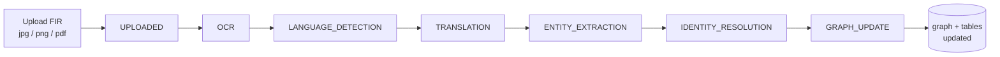
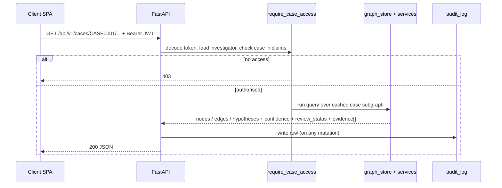

<div align="center">

# 🛰️ VYUHAM INTELLIGENCE — Backend

### AI-Powered Criminal Network Analysis · SIH26189

*Ingest case records → resolve entities → build a knowledge graph → run explainable analytics → serve it all through one REST API.*


</div>

---

## ⚖️ The one rule that shapes everything

> **Nothing this backend returns is a verdict.**
> Every AI-derived field ships with a `confidence` **and** a `review_status`
> (`CONFIRMED` / `AI_SUGGESTED` / `PENDING_REVIEW` / `DISPUTED`). Every
> relationship, pattern, path and summary traces back to concrete `evidence_id`s
> a human can open. **If an endpoint can't cite its evidence, it isn't done.**

The system is a *diagnostic force multiplier for investigators* — it proposes,
ranks and explains; a person decides.

---

## 🚀 Quickstart

```bash
cd backend
python -m venv .venv && .venv\Scripts\activate       # source .venv/bin/activate on *nix
pip install -r requirements.txt

python scripts/seed_from_datasets.py                 # ~98k rows → data/vyuham.db  (~10s)
python scripts/make_demo_fir.py --all                # render FIR document images

cd ../frontend && npm install && npm run build       # build the SPA once
cd ../backend && uvicorn app.main:app --reload --port 8000
```

| URL | What |
|---|---|
| **<http://localhost:8000/>** | **The app** — React SPA, served same-origin by FastAPI |
| <http://localhost:8000/docs> | Swagger UI — every endpoint, "Try it out" |
| <http://localhost:8000/tester> | Bare-metal API test harness (one HTML page, no build) |
| <http://localhost:8000/health> | `{status, graph_nodes, graph_edges}` |

```bash
python scripts/evaluate.py     # the judge-facing proof — scores live analytics vs planted ground truth
```

### Demo logins &nbsp;(`password: vyuham123`)

| id | role | case access |
|----|------|-------------|
| `INV001` | LEAD_INVESTIGATOR | all cases |
| `INV002` | INVESTIGATOR | CASE0001–CASE0010 |
| `INV003` | ANALYST | CASE0001, CASE0002, CASE0005 |
| `INV004` | SUPERVISOR | all cases |

---

## 🧭 How it works — the pipeline

```mermaid
flowchart LR
    subgraph SOURCES["INPUT"]
      direction TB
      A1["Seed dataset<br/>28 JSONL / XLSX files"]
      A2["Live FIR upload<br/>jpg / png / pdf"]
    end

    subgraph INGEST["1 - INGEST"]
      direction TB
      B1["Bulk loader<br/>seed_from_datasets.py"]
      B2["7-stage job<br/>UPLOADED to GRAPH_UPDATE"]
    end

    subgraph STORE["2 - STORES"]
      direction TB
      C1[("SQLite<br/>source of truth<br/>25 tables + audit")]
      C2[("NetworkX<br/>in-process graph<br/>4,890 nodes / 9,000 edges")]
    end

    subgraph ANALYTICS["3 - ANALYTICS"]
      direction TB
      D1["Centrality x6<br/>PageRank, betweenness, eigenvector,<br/>degree, Katz, closeness"]
      D2["Louvain communities"]
      D3["7 pattern detectors"]
      D4["MO similarity + identity resolution"]
      D5["Link prediction, connection paths,<br/>persons of interest, geo radius"]
    end

    subgraph INTEL["4 - INTELLIGENCE"]
      direction TB
      E1["Composite risk score<br/>0-100 + band + narrative"]
      E2["Evidence-cited explanations"]
      E3["Entity + case summaries"]
    end

    subgraph API["5 - DELIVERY"]
      direction TB
      F1["REST API /api/v1<br/>13 contracts + enhancement layer"]
      F2["JWT auth, per-case access, audit log"]
      F3["React SPA served at /"]
    end

    A1 --> B1 --> C1
    A2 --> B2 --> C1
    C1 --> C2
    C1 --> ANALYTICS
    C2 --> ANALYTICS
    ANALYTICS --> INTEL
    INTEL --> API
    ANALYTICS --> API
```



### Two ingestion paths, one store

**A · Bulk seed load** — `scripts/seed_from_datasets.py` unzips the synthetic
dataset, infers a table per file (columns = union of keys seen), bulk-inserts
~98k rows, then builds the graph from `relationships.jsonl`.
*One command → a fully populated, demoable system.*

**B · Live document intake** — a genuine 7-stage state machine (OCR/MT stubbed
for the demo; language + entity counts pulled from the seed tables; production
swap-points isolated in `services/jobs.py`). Poll `GET /jobs/{id}/events` for
the current stage.



### Request lifecycle (every protected endpoint)



---

## 🗺️ API surface — `/api/v1`

All list endpoints paginate (`?page=&page_size=`, default 25) and return
`{ items, total, page, page_size }`. All timestamps ISO-8601 UTC.

### The 13 screen contracts

| Screen | Endpoint(s) |
|---|---|
| **Sign-in** | `POST /auth/login` |
| **Overview** | `GET /cases/{id}/summary` · `GET /cases/{id}/influencers` |
| **Document Intake** | `POST /cases/{id}/documents` · `GET /jobs/{job_id}/events` · `GET /cases/{id}/documents` |
| **Network Explorer** | `POST /cases/{id}/graph/query` |
| **Entity Profile** | `GET /cases/{id}/entities/{eid}/summary` · `GET /cases/{id}/relationships/{rid}` · `GET /cases/{id}/entities/{eid}/document-mentions` |
| **Timeline** | `GET /cases/{id}/timeline` |
| **Pattern Detection** | `GET /cases/{id}/patterns?type=&cross_case=` |
| **MO Comparison** | `GET /incidents/{id}/similar-mo` |
| **Identity Review** | `GET /cases/{id}/resolution-candidates` · `POST …/{cid}/action` · `POST …/{cid}/reverse` |
| **Evidence Gaps** | `GET /cases/{id}/evidence-gaps` |
| **Case Registry** | `GET /cases?status=&district=&search=` |
| **Case Briefing** | `POST /cases/{id}/export` |
| **Audit Log** | `GET /audit-log?investigator=&action=` |

### ✨ Enhancement layer *(borrowed & adapted from TATVA, ROXANNE & the POLE model)*

| Capability | Endpoint | Why it matters |
|---|---|---|
| **Connection path** — all shortest paths between two entities, evidence on every hop | `POST /cases/{id}/graph/path` | Answers the question investigators actually ask: *"how are these two linked?"* |
| **Suggested links** — Adamic-Adar + Jaccard over non-edges, shipped `AI_SUGGESTED` | `GET /cases/{id}/suggested-links` | The graph starts *proposing* leads, not just drawing what's known |
| **Persons of interest** — peripheral figures adjacent to many named suspects | `GET /cases/{id}/persons-of-interest` | Surfaces couriers / recruiters / witnesses before they're suspects |
| **Geospatial radius** — activity within *N* metres of a location (haversine) | `GET /cases/{id}/entities/near?location_id=&radius_m=` | Ties the network to physical space |
| **Composite risk score** — 0–100 + band + plain-English narrative (also on entity summary & influencers) | `GET /cases/{id}/entities/{eid}/risk` | One defensible number, one sentence behind it |
| **Analytics capabilities** — self-describing algorithm list | `GET /analytics/capabilities` | Everything the engine can do, in one call |

Every graph node also carries **`pole_category`** (`PERSON` / `OBJECT` / `LOCATION` / `EVENT`) —
the model law enforcement already works in.

### The contract to get exactly right — collapsed edges

`POST /cases/{id}/graph/query` returns **collapsed logical edges**, not raw
relationship rows. Six `CALLED` rows between two phones come back as **one**
edge with `relationship_ids: [...]`, an aggregated `evidence_summary` (templated
`explanation`), and the full `evidence[]` list.

> **Worked example that must hold:** query rooted at `PH0061` in `CASE0001` →
> `E_PH0061_PH0062_CALLED` contains `R000601` with a non-empty `evidence_summary`.

`document-mentions` returns `bounding_box: {x, y, width, height}` in **pixel**
coordinates — the frontend overlay assumes pixels, not percentages.

---

## 🧠 Algorithms

| Area | Method | Notes |
|---|---|---|
| **Influencer ranking** | PageRank · betweenness · eigenvector · degree · **Katz** · **closeness** | Combined normalised-rank score; each top entity tagged with an influence reason (`ORG_LEADER`, `HUB_OF_COMMUNICATION`, `FINANCIER`, `BROKER_BETWEEN_CLUSTERS`, `RECRUITER`) |
| **Community detection** | Louvain (`python-louvain`), greedy-modularity fallback | Feeds "related entities" + link-prediction features |
| **Suspicious patterns** | 6 canonical rule-based detectors + 1 composite | `STRUCTURING`, `CIRCULAR_FLOW`, `MULE_ACCOUNT`, `PRE_INCIDENT_CALL_BURST`, `UNUSUAL_TIMING`, `CROSS_CASE_RECURRENCE` — all explainable, all scored against 20 deliberate false-positive traps. Plus `COORDINATED_SEQUENCE` (call burst **and** financial pattern in one case, sharing people) |
| **Link prediction** | Adamic-Adar + Jaccard over non-adjacent pairs sharing ≥2 neighbours | Community-aware; returns leads as `AI_SUGGESTED` |
| **MO similarity** | 6 equally-weighted features, `score = matches / 6` | Exactly the feature set in `mo_ground_truth.jsonl` |
| **Identity resolution** | `rapidfuzz` name match across name/alias/transliteration, boosted by matching DOB + district | Reversible `ACCEPT`/`DEFER`/`REJECT`; `ACCEPT` merges nodes without hard-deleting either original |
| **Composite risk** | `Σ (pattern_weight × confidence × recency-decay)` → curved 0–45, + centrality 0–40, + risk-indicator bump 0–15 | Time decay measured against the case's *own* most-recent activity (data is dated 2024) |
| **"Explain this link"** | Deterministic template — group evidence by `source_type`, count, take date range | An LLM call is a stretch upgrade, not a dependency |

---

## 🎯 Ground-truth scorecard

Six files in the dataset exist purely to score the system **before judges do**.
`python scripts/evaluate.py` runs the live pipeline against them:

```
════════════════════════════════════════════════════════════════════════
  VYUHAM INTELLIGENCE  --  GROUND-TRUTH SCORECARD
════════════════════════════════════════════════════════════════════════
NETWORK RECOVERY     : precision 100.0%  recall 100.0%   (126 rows: 90 TRUE / 36 FALSE)
INFLUENCER RANKING   : top-3 hit rate  47.8%             (90 rows across 5 reasons)
MO SIMILARITY        : mean abs error 0.086 vs expected  (205 rows; 78% same-group agreement)
PATTERN DETECTION    : precision 100.0%  recall 100.0%   (100 rows: 80 real / 20 traps → 0 FPs)
EVIDENCE GAPS        : recall 100.0% on planted gaps     (70 rows; 6/6 planted missing-location)
IDENTITY RESOLUTION  : accuracy 100.0%                   (40 person-person rows scored)
════════════════════════════════════════════════════════════════════════
```

> *"Our system scores 100% recall on our own planted ground truth, with zero
> false positives on the 20 traps"* — a demo line backed by a number.

Influencer top-3 is the known soft spot; every other category is at ceiling.

---

## 🏗️ Stack — chosen for a zero-infra demo

| Layer | Choice | Why |
|---|---|---|
| API | **FastAPI** (Python 3.11+) | async, auto Swagger, fast to build |
| Relational store | **SQLite** (`data/vyuham.db`) | stands in for Postgres — identical API contract, **no Docker** |
| Graph store | **NetworkX** in-process | every algorithm we need, built at startup over ~9k edges; swap Neo4j in `graph_store.py` without touching routers |
| Auth | **JWT** (`python-jose`) + `pbkdf2_sha256` | investigator login, role + case-list claims, enforced per case |
| Fuzzy matching | `rapidfuzz` | identity resolution |
| Communities | `python-louvain` | modularity partitioning |
| Doc rendering | `Pillow` | `make_demo_fir.py` only — not needed by the API |

> The spec's intended stack is Postgres + Neo4j via Docker. This machine has no
> Docker; the dataset is ~5k nodes / 9k edges. **The algorithms matter more than
> the database** — everything runs in-process, one `pip install`, one `uvicorn`.

---

## 📄 Demo documents

The dataset references `/documents/FIR####.png` but ships no images.
`scripts/make_demo_fir.py` renders them from the seed tables:

```bash
python scripts/make_demo_fir.py --all      # FIR0001, FIR0002 + a fabricated SC01 follow-up
python scripts/make_demo_fir.py FIR0007    # any real seed FIR by id
python scripts/make_demo_fir.py --new      # FIR-2024-DEMO-511 only
```

| File | Type | On upload → pipeline reports |
|---|---|---|
| `FIR0001.png` | Real seed FIR — Vellore jewellery theft (Tamil) | `detected_language: ta`, real entity count — resolves to the actual case FIR |
| `FIR0002.png` | Real seed FIR — South Delhi burglary (Hindi) | resolves to the second FIR on CASE0001 |
| `FIR-2024-DEMO-511.png` | **Fabricated** follow-up in the SC01 storyline | treated as a *new upload* → falls back to the case's primary-FIR metadata |

Every entity in them is real (Asha Khan `P0400`, Manu Pillai `P0446`, phones
`6100501329`/`8100517167`, vehicle `TN01__1000`, accounts `A0175`/`A0241`,
org `O0001` "Lotus Network", location `L0116`). Output → `backend/data/documents/`,
served at `/documents/<name>.png` — which also fixes the frontend evidence viewer.

---

## 🎬 60-second demo script

1. **Sign in** `INV001` → land on Overview: KPIs, activity chart, priority follow-ups.
2. **Network Explorer** → root `PH0061`, 2 hops → the collapsed-edge graph. Click a node → Entity Profile with `risk` (score + band + narrative), influence, community peers, evidence chains.
3. **`POST /graph/path`** `PH0061` → `PH0062` → the connection, evidence on every hop.
4. **Suggested links** → *"these two share connections but have no recorded link"* — a lead, marked `AI_SUGGESTED`.
5. **Patterns** → structuring / call-burst / cross-case hypotheses, each citing records.
6. **Document Intake** → upload `FIR-2024-DEMO-511.png` → watch it walk the 7 stages.
7. **Identity Review** → accept a merge → **reverse** it → both show in the **Audit Log**.
8. **`python scripts/evaluate.py`** → the scorecard. Screenshot it.

---

## 📁 Project structure

```
backend/
├── app/
│   ├── main.py              FastAPI app · router registration · static mounts · SPA serving
│   ├── config.py deps.py common.py
│   ├── routers/             one file per screen group + analytics.py (enhancement layer)
│   ├── static/index.html    dev API test harness  (served at /tester)
│   └── services/
│       ├── graph_store.py       NetworkX graph · collapsed-edge API · identity merges · POLE tags
│       ├── centrality.py        influencer ranking (6 centralities + reason tagging)
│       ├── communities.py       Louvain
│       ├── patterns.py          6 canonical detectors (API + evaluator) + COORDINATED_SEQUENCE
│       ├── analytics_ext.py     connection paths · link prediction · persons of interest · geo
│       ├── risk.py              composite entity risk score + time decay + narrative
│       ├── mo_similarity.py     6-feature MO scoring
│       ├── identity_resolution.py   rapidfuzz candidate generation + scoring
│       ├── explain.py           templated "explain this connection" text
│       ├── jobs.py              7-stage document-intake state machine
│       └── timeline.py security.py audit.py db.py
├── scripts/
│   ├── seed_from_datasets.py    bulk load → data/vyuham.db   (run first)
│   ├── make_demo_fir.py         render FIR document images
│   └── evaluate.py              ground-truth scorecard
├── data/vyuham.db              generated · gitignored
├── data/documents/              FIR images · served at /documents/
└── requirements.txt

frontend/                        vite + React SPA → npm run build → dist/ (served by the backend at /)
```

---

## 🔌 Frontend integration

The React SPA is served **same-origin** by FastAPI at `/` — no CORS, no second
port, one process. It talks to `/api/v1` and stores its JWT in `localStorage`.

- **Prod / demo:** `npm run build` in `frontend/` → the backend serves `dist/`
  (SPA fallback in `main.py`, so a hard refresh on `/network` works).
- **Frontend dev:** `npm run dev` in `frontend/` → vite on `:5174` proxies
  `/api` to `:8000` with hot reload.
- If `frontend/dist/` is missing, the backend serves the test harness at `/`.

---

<div align="center">
<sub>SIH26189 · Vyuham Intelligence · all data synthetic and fictional</sub>
</div>
